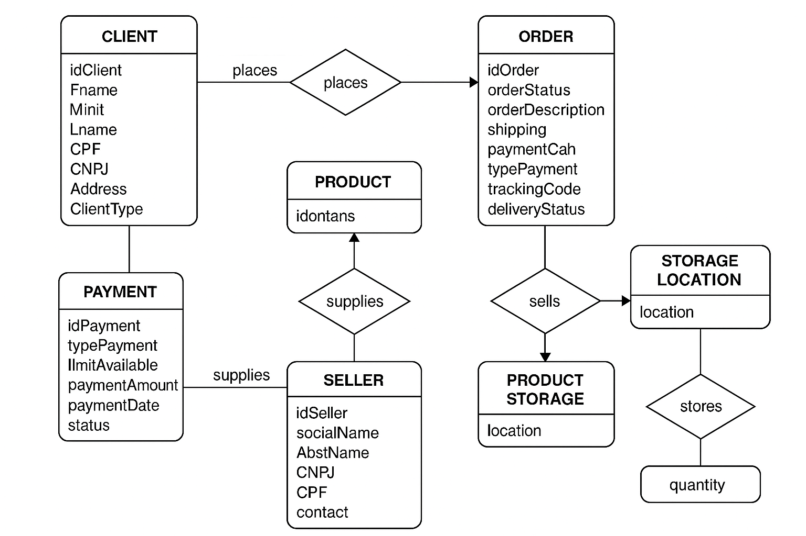
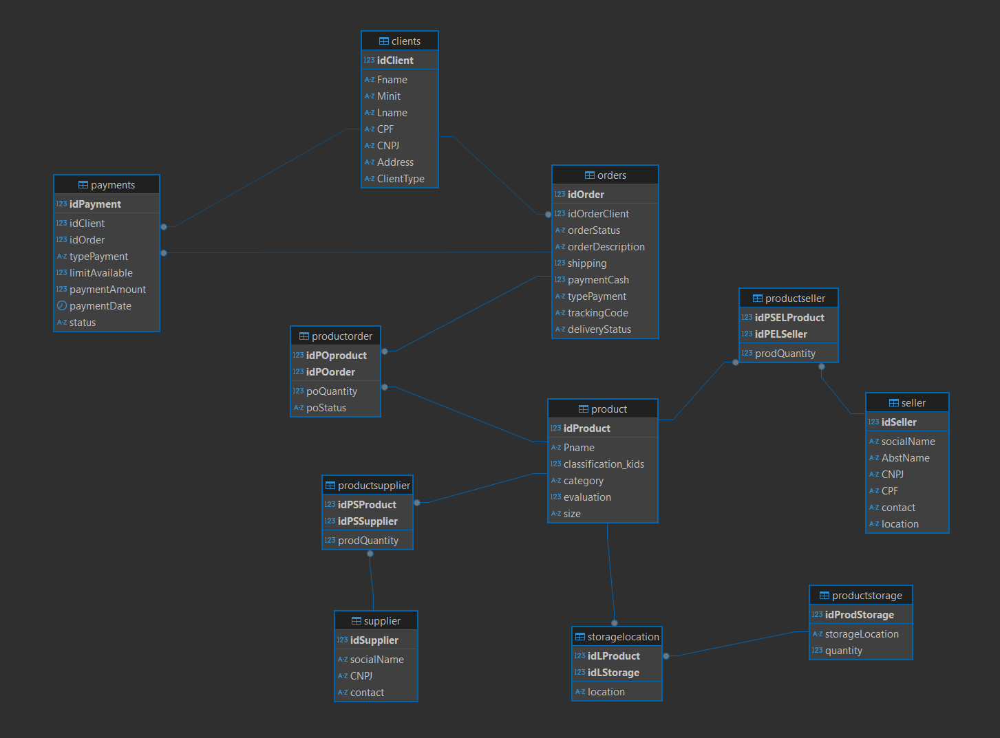
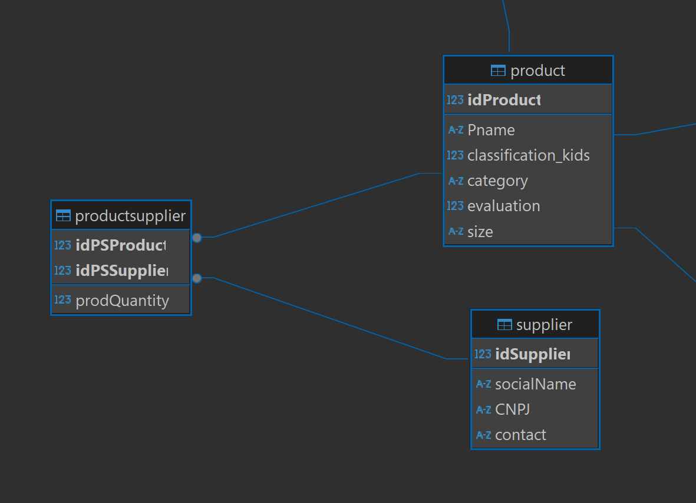
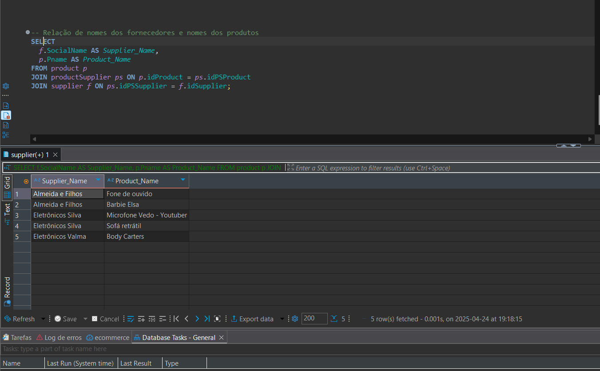

# 🛒 Projeto de Modelagem e Banco de Dados para E-commerce

## 📌 Descrição

Este projeto tem como objetivo a modelagem e implementação de um banco de dados relacional para um sistema de e-commerce. A proposta envolve a aplicação de conceitos de modelagem de dados, normalização, integridade referencial e consultas SQL para representar com precisão o funcionamento de uma loja virtual.

---

## 🎯 Objetivos

- Modelar entidades e relacionamentos típicos de um e-commerce.
- Aplicar chaves primárias, estrangeiras e constraints para garantir a integridade dos dados.
- Criar um script SQL completo para construção do banco de dados.
- Inserir dados de exemplo para simulações e testes.
- Desenvolver consultas SQL que representem situações reais do sistema.

---

## 📦 Entidades Modeladas

- **Cliente** (Pessoa Física e Jurídica)  
- **Produto**  
- **Fornecedor**  
- **Pedido**  
- **Pagamento**  
- **Entrega**

---

## 🔁 Relacionamentos e Regras de Negócio

- **Cliente x Pedido (1:N)** — Um cliente pode fazer vários pedidos.  
- **Pedido x Produto (N:M)** — Um pedido pode incluir diversos produtos e um produto pode estar presente em vários pedidos.  
- **Pedido x Pagamento (1:N)** — Um pedido pode ter mais de uma forma de pagamento.  
- **Pedido x Entrega (1:1)** — Cada pedido possui uma entrega correspondente.  
- **Produto x Fornecedor (N:1)** — Um fornecedor pode fornecer diversos produtos.

---

## 🧩 Modelagem Visual

📷 **Diagrama Entidade-Relacionamento (ERD):** 

📷 **Modelo Relacional:**  

 

📷 **Exemplo de Relacionamento entre Tabelas:**  

---

## 📁 Estrutura do Projeto

- `modelagem/`: diagramas ER e modelo relacional  
- `scripts/`: criação de tabelas e inserção de dados  
- `consultas/`: conjunto de queries SQL desenvolvidas

---

## 🔎 Consultas SQL Desenvolvidas

- Total de pedidos por cliente  
- Relação de produtos e seus fornecedores  
- Status de entregas por pedido  
- Métodos de pagamento utilizados por cada cliente

📷 **Exemplo de consulta SQL:**  

---

## ✅ Resultados

- Modelo relacional completo, representando as principais operações de um e-commerce.  
- Aplicação prática de normalização, integridade referencial e modelagem de relacionamentos complexos.  
- Estrutura pronta para implementação em sistemas baseados em MySQL.

---

## 📚 Recursos Recomendados

- [MySQL Workbench](https://www.mysql.com/products/workbench/)  
- [Documentação MySQL](https://dev.mysql.com/doc/)  
- [Guia de Modelagem de Dados – Lucidchart](https://www.lucidchart.com/pages/pt/modelagem-de-dados)
- [DBeaver Community](https://dbeaver.io)  

---

## 🚀 Próximos Passos (Sugestões de Continuidade)

Este modelo pode ser facilmente adaptado e expandido para projetos reais. Algumas ideias para quem quiser evoluir este projeto:

- Integrar o banco de dados com um backend (ex: Node.js, Django, Laravel).
- Criar uma API RESTful para consumo dos dados por aplicações externas.
- Desenvolver uma interface frontend simulando a loja virtual.
- Adicionar validações, triggers e procedures para regras de negócio específicas.
- Implementar testes automatizados com dados simulados.
- Utilizar versionamento de banco com ferramentas como Flyway ou Liquibase.

